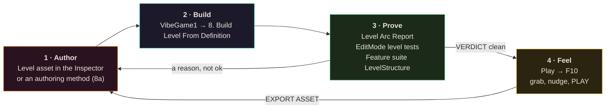
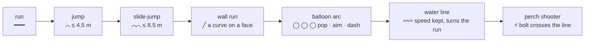
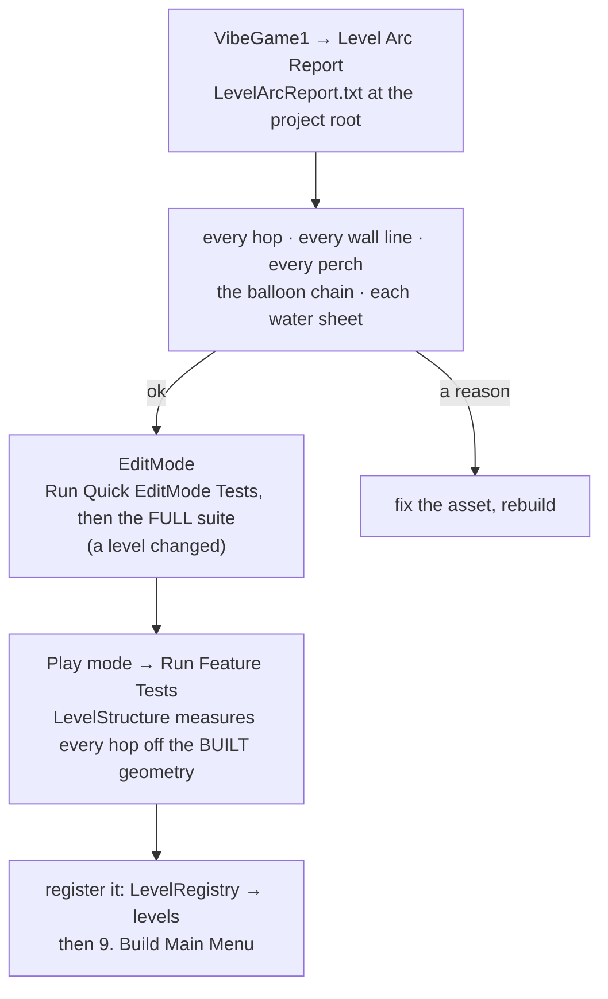
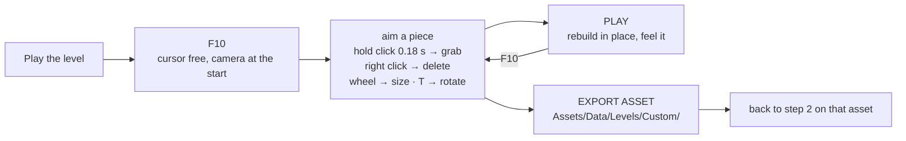

# Making a level

**Author it in the Unity editor. Feel it in the in-game editor. Prove it with the report and the tests.**

The level is a data asset. The scene is disposable output. The in-game editor (`F10`) is a hand on the level
for nudging a piece and playing the change; it is not where levels are made. Read this on the
`/dashboard` page for the diagrams.

Related: [AUTHORING.md](AUTHORING.md) §1 (every field) · [LEVEL-EDITOR.md](LEVEL-EDITOR.md) (every key) ·
[MOVEMENT-PRINCIPLES.md](MOVEMENT-PRINCIPLES.md) (what a good span is)

---

## The loop



One rule under everything: **never drag boxes in the Scene view.** The next rebuild deletes them. Numbers go
in the asset (or the authoring method), then rebuild.

---

## 1 · Author

### Start from a level that plays

Duplicate `Assets/Data/Levels/Level_01_Level.asset` (Ctrl+D) and rename it. Deleting pieces you do not want
beats starting from nothing.

### Identity (Inspector, top of the asset)

| Field | Rule |
|---|---|
| `levelId` | lowercase, **never renamed** after a build ships: progress, best runs and ghosts are keyed by it |
| `displayName` `sceneName` | the menu name and a new scene name (the builder creates the scene) |
| `orderIndex` `parTime` | campaign position, target seconds |

### Lay each span as a shape

A span is a sentence of shapes (MOVEMENT-PRINCIPLES rule 7). Read the profile left to right:



<svg viewBox="0 0 900 190" width="100%" style="max-width:900px;background:#0b0710;border-radius:10px">
  <text x="12" y="20" fill="#9a918a" font-size="12">side view of one span — platforms, an arc, a water sheet and a perch</text>
  <rect x="20" y="140" width="120" height="30" fill="#3c3f4d" stroke="#e8e2d6"/><text x="30" y="160" fill="#e8e2d6" font-size="11">run deck</text>
  <rect x="190" y="120" width="70" height="50" fill="#3c3f4d" stroke="#e8e2d6"/><text x="196" y="145" fill="#e8e2d6" font-size="11">+1.5 m</text>
  <path d="M140 140 Q165 95 190 120" fill="none" stroke="#4fe0d0" stroke-width="2"/><text x="135" y="88" fill="#4fe0d0" font-size="11">jump ≤ 4.5 m</text>
  <rect x="330" y="110" width="140" height="60" fill="#3c3f4d" stroke="#e8e2d6"/>
  <rect x="330" y="106" width="140" height="4" fill="#3a8fff"/><text x="336" y="100" fill="#3a8fff" font-size="11">water sheet on the top</text>
  <path d="M260 120 Q295 60 330 110" fill="none" stroke="#4fe0d0" stroke-width="2" stroke-dasharray="4 3"/><text x="262" y="60" fill="#4fe0d0" font-size="11">slide-jump ≤ 8.5 m</text>
  <circle cx="520" cy="85" r="9" fill="#ffd166"/><circle cx="560" cy="60" r="9" fill="#ffd166"/><circle cx="600" cy="38" r="9" fill="#ffd166"/>
  <text x="505" y="115" fill="#ffd166" font-size="11">arc: ~5 m apart, 2–3 m up</text>
  <path d="M470 110 Q495 90 520 85" fill="none" stroke="#ffd166" stroke-width="1.5"/>
  <rect x="640" y="70" width="140" height="100" fill="#3c3f4d" stroke="#e8e2d6"/><text x="650" y="95" fill="#e8e2d6" font-size="11">landing span</text>
  <rect x="820" y="40" width="40" height="20" fill="#8a6a3a" stroke="#e8e2d6"/><text x="806" y="34" fill="#ff5c5c" font-size="11">perch ⚡</text>
  <path d="M820 50 L690 100" stroke="#ff7a1e" stroke-width="1.5" stroke-dasharray="3 3"/><text x="700" y="60" fill="#ff7a1e" font-size="11">bolt line, 6–30 m, clear</text>
  <line x1="0" y1="170" x2="900" y2="170" stroke="#444"/>
</svg>

Each `platforms` element is one box: `center`, `size`, `materialKey` (`Platform`, `Stone`, `NeonPink` …
the `M_` material names without the prefix), `trim` + `trimMaterialKey` for the neon edge that makes a tile
read as a place. **The walkable top is `center.y + size.y / 2`.**

### The reach contract (never exceed it)

| Move | Rise | Gap | Note |
|---|---|---|---|
| Base jump | ≤ 1.5 m | ≤ 4.5 m | or rise ≤ 1 m with gap ≤ 6 m |
| Slide-jump | ≤ 1 m | ≤ 8.5 m | Left Ctrl then Space |
| Wall jump | ≤ 1.6 m per push | faces 1.5–3 m apart | different heights so the climb has an exit |
| Balloon pop | +2 m, then a float | ~5 m to the next orb | launch 11 m/s, carry trimmed to 9 m/s, 0.45 s float |
| Water | — | — | keeps speed; a slide never decays on it |

A fast, tech-gated line is always a **shortcut past** a slow route, and it **rejoins before the next arena
trigger**, or it soft-locks the run.

### The rest of the asset

| Array | What to set |
|---|---|
| `balloons` | orbs in an ARC: ~5 m apart, 2–3 m up each; the analyser flies the chain |
| `waters` | a thin sheet ON a platform top (`center.y = top + size.y / 2`) with a `flowDirection` |
| `spawns` | Grunts and Heavies are SHOOTERS: put them on a perch beside the course where the bolt crosses the line you want the parry boost on (AUTHORING §1a′). Mini-bosses go in `arenas` |
| `checkpoints` | the `name` matters: F5 warps to the last one |
| `pickups` `pedestals` | items by key; the wand altar (no altar, no wand) |
| `arenas` `torches` `playerStart` `killZone` | gated fights, light, where you start, where you die |

Authoring in code beats the Inspector for anything you will re-run: `Editor/LevelDefinitionAuthoring.cs`
(menu **8a**) rewrites the asset deterministically and `LevelTraversalTests` proves it on a copy first.

---

## 2 · Build

Select the asset → **VibeGame1 → 8. Build Level From Definition**.

Read the console line. The counts must be what you authored:

```
[LevelDefinitionBuilder] 106 boxes, 232 trims, 10 spawners, 44 torches, 11 pickups, 3 balloons, 3 waters, 4 checkpoints, navmesh built=True
```

---

## 3 · Prove



The report says `ok` or gives a reason per item. Fix the reason, never the test.

### Measuring without the editor

`python Tools/level_arc_offline.py` mirrors `LevelArcAnalyzer.AnalyzeHop` and the traversal checks in
pure Python, so a shape can be measured while the lead has Unity. It parses the `Reshapes`, `RouteBeacons`
and `Waters` tables straight out of `LevelDefinitionAuthoring.cs` and the boxes out of the level asset —
nothing is typed twice, because the one time it was, a rail centre was transcribed 0.2 m off and the tool
happily agreed with the typo. `--after` applies the reshape table first (before/after in one diff);
`--torches` prints the URP 4-light cluster budget. The editor's report and the `Level*Tests` stay the
authority; this is how you arrive at the number you ask the lead to confirm.

### The number to watch is CLEAN LAUNCH POINTS, not the gap

`AnalyzeHop` samples 25 take-off spots on the departing deck and reports how many have at least one clean
arc. **Shrinking a gap can make a hop worse.** Growing the take-off deck moves those sample points with
it, and room added on the wrong side of an obstruction buys nothing while the gap number improves — the
2026-09-06 openness pass grew `T2_L8` and watched `T2_L8 → T2_L9` go from gap 4.24 / 10 clean points to
gap 3.91 / **8**, because the extra deck was east of the tower the hop has to round. The fix was to grow
the **landing** deck instead (`T2_L9` matched to `T2_L3`, its twin one lap below): gap 3.20, 13 clean
points. Read both columns, every hop, before and after.

Same class of trap on a rail: a rail's inner face belongs **flush with the deck edge with its body
hanging outside**. A 0.2 m rail standing *on* the deck costs a capsule radius of take-off room either
side of it, which is a whole sampled column of launch points on a narrow deck.

The corollary, learned in the second openness pass: **a deck can be grown on BOTH sides.** `T2_L1` had to
come south to shorten the level's worst hop (`T2_Entry → T2_L1`, 6 clean points of 25) and that cost the
next hop five points — so it grew north 1 m as well, which handed the take-off room straight back.
`T2_Entry → T2_L1` 6 → **13** and `T2_L1 → T2_L2` holds at 20. Never pay for a landing with a take-off if
the deck has a free edge in the other direction.

And the mirror of it: **grow along the axis the gap is NOT measured on.** `T2_L6` at 7 m wide collapsed
both its gaps to 1.10 m — a step, not a hop, a dead beat in the middle of a climb. At 7 m *deep* it is
the same 35 m² of balcony, both gaps hold at 2.10 m, and both hops still improve (21 → 23 each way).

### The other number: MOVES VISIBLE AHEAD

`python Tools/level_arc_offline.py --sight` stands the eye at each route deck's centre 1.7 m up, looks at
the next six decks' surfaces, and counts how many it can see in a row before something opaque intervenes.
**A level whose answer is 1 is a corridor however wide its decks are**, because the route is being handed
to the player one box at a time. It is the measurement that turns "this feels cramped" into a name and a
number, and it caught three things the arc report structurally cannot see:

- a **slide gate parked on its deck's exit edge** (`T1_Fallen_Obelisk` at z 63) was the first blocker from
  six consecutive vantage points, and left the 22 m causeway itself seeing **nothing at all**. Moved to
  the deck's entry third it is read from three decks back instead of arriving in your face — and the exit
  hop off that deck went 5 clean points of 20 to **20 of 25**, because the slab had been standing 1.4 m
  behind the take-off edge;
- a **5 m core in a 19 m helix** (`T2_Tower`) was the first blocker from eight of the spiral's eleven
  decks. At 4 m it is 2.45 → 3.00 for the whole level;
- **6 m doorways in 26 m arena walls**. The arena floors are the only wide rooms in the level and the
  doors were throwing that away. At 9 m, `T1_Arena → T2_Entry` goes 13 clean points to 21.

When you widen an arena doorway, widen its **gate and its trigger with it** (`ArenaDef.gateSize`,
`exitGateSize`, `triggerSize`) — a 9 m door with a 6 m trigger is a door you walk through at x 4 while the
fight never starts.

### The third number: WHERE THE FIRST CUE LANDS

A perch has one more measurement and the arc report does not print it, because it is not about the bolt
line — it is about **when the encounter starts**. The parry window is not yours: `Projectile.CueLead` is a
flat 0.28 s for every attack in the game and `ProjectileShooter.CueMargin` floors a near bolt's flight at
0.44 s, so **no shape you draw makes a parry easier by giving the player more of a window**. Two things
DO belong to you:

- **When the sentry wakes.** `EnemyController.WakeRange` is `max(aggroRange, projectileMaxRange)` — 32 m
  for `pshooter_enemy01`. Solve that radius against the line the player runs and you get the exact z the
  encounter begins at. That is the "runway": everything before it is unopposed.
- **What the player is DOING when the cue lands.** Add `projectileAcquireDelay` (0.7 s) of approach at
  running speed, then the flight (`distance / projectileSpeed`, floored to 0.44 s), and you get the impact
  point. **If that point is over a gap, the level's first parry is asked of a player in mid-air**, and no
  amount of extra distance fixes it — they had the time and spent it on the jump.

That is exactly what was wrong with T1's opening on 2026-09-07: `T1_Perch_W` at z 44 solved to a wake at
z 13.1, *before the level's first ramp*, and its opening bolt arrived at z ~27.5 — the gap between
`T1_Stone_2` and `T1_Stone_3`. Moving the perch to `(-11.5, 3.5, 53)` moved the wake to z 23.3 and the
impact to z 37.9, mid-deck. Nothing about the bolt changed. When a player says "I need more time to
parry", do this arithmetic before you lengthen anything: **the budget is usually not short, it is spent.**

The other edge of the same band bites in the opposite direction: a perch standing broadside inside
`projectileMinRange` goes **silent** exactly where it is meant to be firing. Check both edges.

A blocker the probe names is not automatically a bug. Two slide gates and four pillars are *supposed* to
be in the way; that is what a gate and a pillar are. Read the name, then decide.

---

## 4 · Feel (the in-game editor)

The in-game editor is for the things a rebuild is too slow for: *is this gap a hair wide, does the orb need
a metre more, where does the bolt actually cross.*



| Key | Does |
|---|---|
| `F10` / F1 → LEVEL EDITOR | open / close |
| WASD · Space · Ctrl · Shift | fly · up · down · fast |
| left click · hold 0.18 s | place · grab (release drops) |
| right click / `X` | delete the aimed piece |
| wheel · Shift+wheel · Ctrl+wheel | size · piece kind · variant |
| `T` · `Tab` | rotate 90° · cursor to the panel |
| SAVE / LOAD / PLAY / EXPORT ASSET | JSON under LocalLow `levels` · list · play in place · write a real asset (Unity editor only) |

Known limits at v1, and the reason it stays a tweak tool: no terrain or lighting, 90° rotation only, the
controls are serviceable rather than smooth. Full keys: LEVEL-EDITOR.md.

---

## Which tool, when

| Want to | Use |
|---|---|
| Lay out a span or a level | the asset in the Unity editor, or an authoring method → **8** → Arc Report |
| Prove reach, lines, arcs, sheets | Level Arc Report · level EditMode tests · `LevelStructure` in the feature suite |
| Feel a gap, nudge an orb, move a perch | **F10** in play → PLAY → EXPORT ASSET → re-prove |
| Recover a level from a hand-edited scene | **Export Current Level To Definition** → rebuild → diff |
| Share a level with a player | SAVE in the in-game editor → the JSON under LocalLow `levels` |

## Done means

- [ ] **8** rebuilds it with the counts you expect and no console errors
- [ ] Level Arc Report VERDICT clean: every perch covers ≥ 2 decks, CHAIN ok, every water sheet ok
- [ ] full EditMode green; feature suite `LevelStructure`, `LevelFlow`, `Gate` green
- [ ] every tech-gated line is a shortcut that rejoins before the next arena trigger
- [ ] a human has run it once and the tweaks went back into the asset
