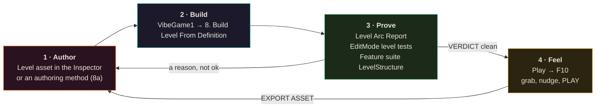
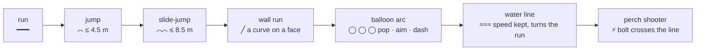
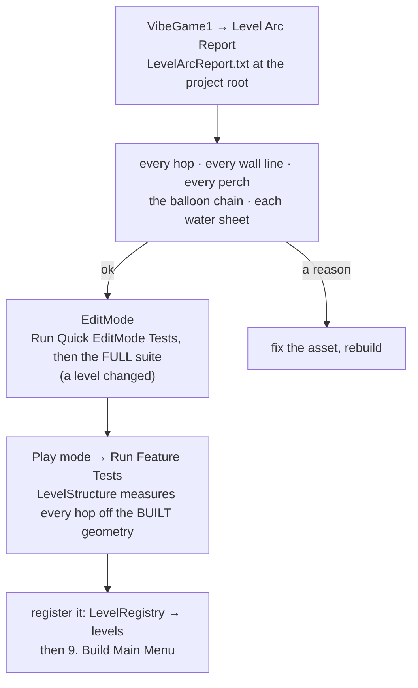
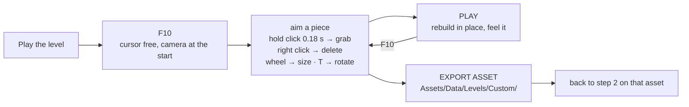

# Making a level

**Author it in the Unity editor. Feel it in the in-game editor. Prove it with the report and the tests.**

The level is a data asset. The scene is disposable output. The in-game editor (`F10`) is a hand on the level
for nudging a piece and playing the change; it is not where levels are made. Read this on the
`/dashboard` page for the diagrams.

Related: [AUTHORING.md](AUTHORING.md) §1 (every field) · [LEVEL-EDITOR.md](LEVEL-EDITOR.md) (every key) ·
[MOVEMENT-PRINCIPLES.md](MOVEMENT-PRINCIPLES.md) (what a good span is)

---

## The loop



One rule under everything: **never drag boxes in the Scene view.** The next rebuild deletes them. Numbers go
in the asset (or the authoring method), then rebuild.

---

## 1 · Author

### Start from a level that plays

Duplicate `Assets/Data/Levels/Level_01_Level.asset` (Ctrl+D) and rename it. Deleting pieces you do not want
beats starting from nothing.

### Identity (Inspector, top of the asset)

| Field | Rule |
|---|---|
| `levelId` | lowercase, **never renamed** after a build ships: progress, best runs and ghosts are keyed by it |
| `displayName` `sceneName` | the menu name and a new scene name (the builder creates the scene) |
| `orderIndex` `parTime` | campaign position, target seconds |

### Lay each span as a shape

A span is a sentence of shapes (MOVEMENT-PRINCIPLES rule 7). Read the profile left to right:



<svg viewBox="0 0 900 190" width="100%" style="max-width:900px;background:#0b0710;border-radius:10px">
  <text x="12" y="20" fill="#9a918a" font-size="12">side view of one span — platforms, an arc, a water sheet and a perch</text>
  <rect x="20" y="140" width="120" height="30" fill="#3c3f4d" stroke="#e8e2d6"/><text x="30" y="160" fill="#e8e2d6" font-size="11">run deck</text>
  <rect x="190" y="120" width="70" height="50" fill="#3c3f4d" stroke="#e8e2d6"/><text x="196" y="145" fill="#e8e2d6" font-size="11">+1.5 m</text>
  <path d="M140 140 Q165 95 190 120" fill="none" stroke="#4fe0d0" stroke-width="2"/><text x="135" y="88" fill="#4fe0d0" font-size="11">jump ≤ 4.5 m</text>
  <rect x="330" y="110" width="140" height="60" fill="#3c3f4d" stroke="#e8e2d6"/>
  <rect x="330" y="106" width="140" height="4" fill="#3a8fff"/><text x="336" y="100" fill="#3a8fff" font-size="11">water sheet on the top</text>
  <path d="M260 120 Q295 60 330 110" fill="none" stroke="#4fe0d0" stroke-width="2" stroke-dasharray="4 3"/><text x="262" y="60" fill="#4fe0d0" font-size="11">slide-jump ≤ 8.5 m</text>
  <circle cx="520" cy="85" r="9" fill="#ffd166"/><circle cx="560" cy="60" r="9" fill="#ffd166"/><circle cx="600" cy="38" r="9" fill="#ffd166"/>
  <text x="505" y="115" fill="#ffd166" font-size="11">arc: ~5 m apart, 2–3 m up</text>
  <path d="M470 110 Q495 90 520 85" fill="none" stroke="#ffd166" stroke-width="1.5"/>
  <rect x="640" y="70" width="140" height="100" fill="#3c3f4d" stroke="#e8e2d6"/><text x="650" y="95" fill="#e8e2d6" font-size="11">landing span</text>
  <rect x="820" y="40" width="40" height="20" fill="#8a6a3a" stroke="#e8e2d6"/><text x="806" y="34" fill="#ff5c5c" font-size="11">perch ⚡</text>
  <path d="M820 50 L690 100" stroke="#ff7a1e" stroke-width="1.5" stroke-dasharray="3 3"/><text x="700" y="60" fill="#ff7a1e" font-size="11">bolt line, 6–30 m, clear</text>
  <line x1="0" y1="170" x2="900" y2="170" stroke="#444"/>
</svg>

Each `platforms` element is one box: `center`, `size`, `materialKey` (`Platform`, `Stone`, `NeonPink` …
the `M_` material names without the prefix), `trim` + `trimMaterialKey` for the neon edge that makes a tile
read as a place. **The walkable top is `center.y + size.y / 2`.**

### The reach contract (never exceed it)

| Move | Rise | Gap | Note |
|---|---|---|---|
| Base jump | ≤ 1.5 m | ≤ 4.5 m | or rise ≤ 1 m with gap ≤ 6 m |
| Slide-jump | ≤ 1 m | ≤ 8.5 m | Left Ctrl then Space |
| Wall jump | ≤ 1.6 m per push | faces 1.5–3 m apart | different heights so the climb has an exit |
| Balloon pop | +2 m, then a float | ~5 m to the next orb | launch 11 m/s, carry trimmed to 9 m/s, 0.45 s float |
| Water | — | — | keeps speed; a slide never decays on it |

A fast, tech-gated line is always a **shortcut past** a slow route, and it **rejoins before the next arena
trigger**, or it soft-locks the run.

### The rest of the asset

| Array | What to set |
|---|---|
| `balloons` | orbs in an ARC: ~5 m apart, 2–3 m up each; the analyser flies the chain |
| `waters` | a thin sheet ON a platform top (`center.y = top + size.y / 2`) with a `flowDirection` |
| `spawns` | Grunts and Heavies are SHOOTERS: put them on a perch beside the course where the bolt crosses the line you want the parry boost on (AUTHORING §1a′). Mini-bosses go in `arenas` |
| `checkpoints` | the `name` matters: F5 warps to the last one |
| `pickups` `pedestals` | items by key; the wand altar (no altar, no wand) |
| `arenas` `torches` `playerStart` `killZone` | gated fights, light, where you start, where you die |

Authoring in code beats the Inspector for anything you will re-run: `Editor/LevelDefinitionAuthoring.cs`
(menu **8a**) rewrites the asset deterministically and `LevelTraversalTests` proves it on a copy first.

---

## 2 · Build

Select the asset → **VibeGame1 → 8. Build Level From Definition**.

Read the console line. The counts must be what you authored:

```
[LevelDefinitionBuilder] 106 boxes, 232 trims, 10 spawners, 44 torches, 11 pickups, 3 balloons, 3 waters, 4 checkpoints, navmesh built=True
```

---

## 3 · Prove



The report says `ok` or gives a reason per item. Fix the reason, never the test.

---

## 4 · Feel (the in-game editor)

The in-game editor is for the things a rebuild is too slow for: *is this gap a hair wide, does the orb need
a metre more, where does the bolt actually cross.*



| Key | Does |
|---|---|
| `F10` / F1 → LEVEL EDITOR | open / close |
| WASD · Space · Ctrl · Shift | fly · up · down · fast |
| left click · hold 0.18 s | place · grab (release drops) |
| right click / `X` | delete the aimed piece |
| wheel · Shift+wheel · Ctrl+wheel | size · piece kind · variant |
| `T` · `Tab` | rotate 90° · cursor to the panel |
| SAVE / LOAD / PLAY / EXPORT ASSET | JSON under LocalLow `levels` · list · play in place · write a real asset (Unity editor only) |

Known limits at v1, and the reason it stays a tweak tool: no terrain or lighting, 90° rotation only, the
controls are serviceable rather than smooth. Full keys: LEVEL-EDITOR.md.

---

## Which tool, when

| Want to | Use |
|---|---|
| Lay out a span or a level | the asset in the Unity editor, or an authoring method → **8** → Arc Report |
| Prove reach, lines, arcs, sheets | Level Arc Report · level EditMode tests · `LevelStructure` in the feature suite |
| Feel a gap, nudge an orb, move a perch | **F10** in play → PLAY → EXPORT ASSET → re-prove |
| Recover a level from a hand-edited scene | **Export Current Level To Definition** → rebuild → diff |
| Share a level with a player | SAVE in the in-game editor → the JSON under LocalLow `levels` |

## Done means

- [ ] **8** rebuilds it with the counts you expect and no console errors
- [ ] Level Arc Report VERDICT clean: every perch covers ≥ 2 decks, CHAIN ok, every water sheet ok
- [ ] full EditMode green; feature suite `LevelStructure`, `LevelFlow`, `Gate` green
- [ ] every tech-gated line is a shortcut that rejoins before the next arena trigger
- [ ] a human has run it once and the tweaks went back into the asset
